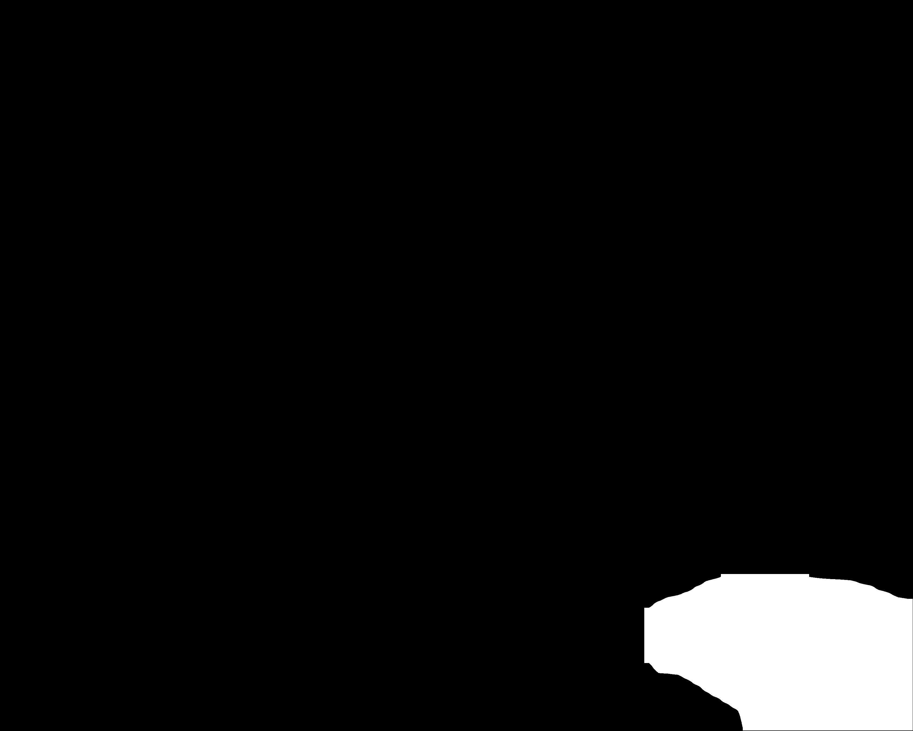
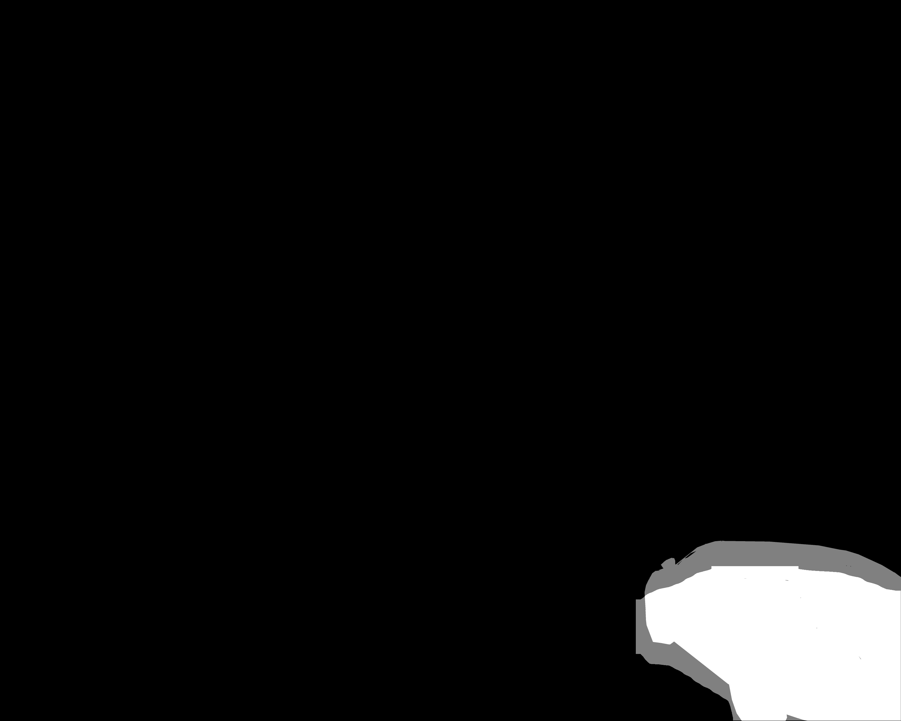

# Kaggle_PKU_Baidu

##  Neural Mesh Renderer

We follow the github repo [chainer](https://github.com/hiroharu-kato/neural_renderer), and there is
a [pytorch](https://github.com/daniilidis-group/neural_renderer) version.

But finally we used the [https://github.com/hzsydy/neural_renderer](https://github.com/hzsydy/neural_renderer)
because it allows image width and height to be different.

### how to install

go to the directory `neural_renderer` and install by
`python setup.py develop`

### Running examples: learning R and T 

`python ./neural_renderer/examples/example4_kaggle.py`

