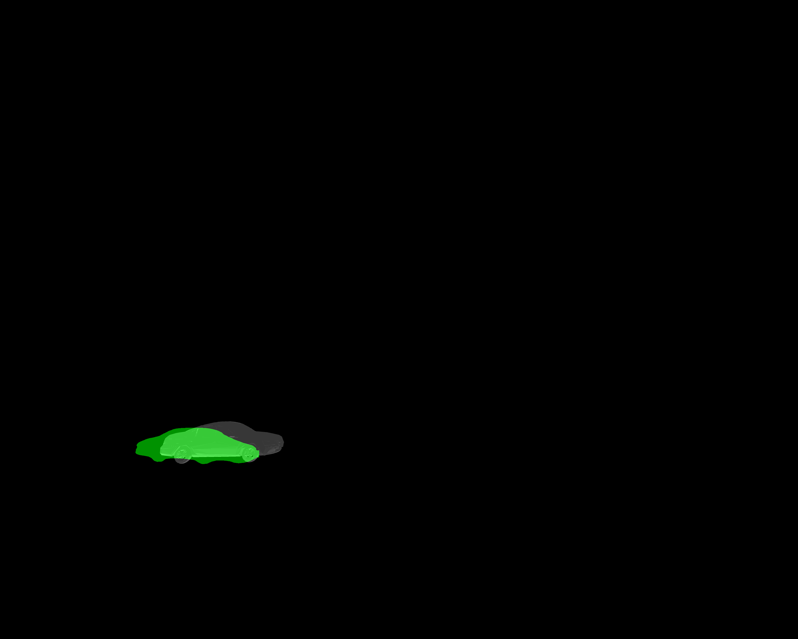

# Neural Mesh Renderer for lighting

## Why we need to learn lighting?

Because if only use silhouette to learn Rotation (R) and Translation (T), 
we observe that the NMR will mostly will use Rotation to minimise the silhouette 
IoU loss. See the example below (green is the ground truth mask):

Hence, we need grayscale information as a stronger supervision.
But since we don't have the color and texture information for the vehicles, we can only utilise the mesh information.
And the direction and intensity of the lighting is important.

### Lighting

Lighting can be applied directly to a mesh. In NMR, there are ambient light
and directional light. Let  and 
 be the  intensities of the ambient light and 
directional light, respectively, 
 be a unit vector indicating the 
direction of the directional light, and $n_j$ be the normal vector of a surface.
The modified color of a pixel 
 on the surface will be
.

In the NMR formulation, gradients also flow into the intensities 
 and 
,
as well as the direction 
of the directional light.
 Therefore, light sources can also be included as an optimisation target.

### Running examples: learning ambient light intensity, directional light intensity and directional light 

