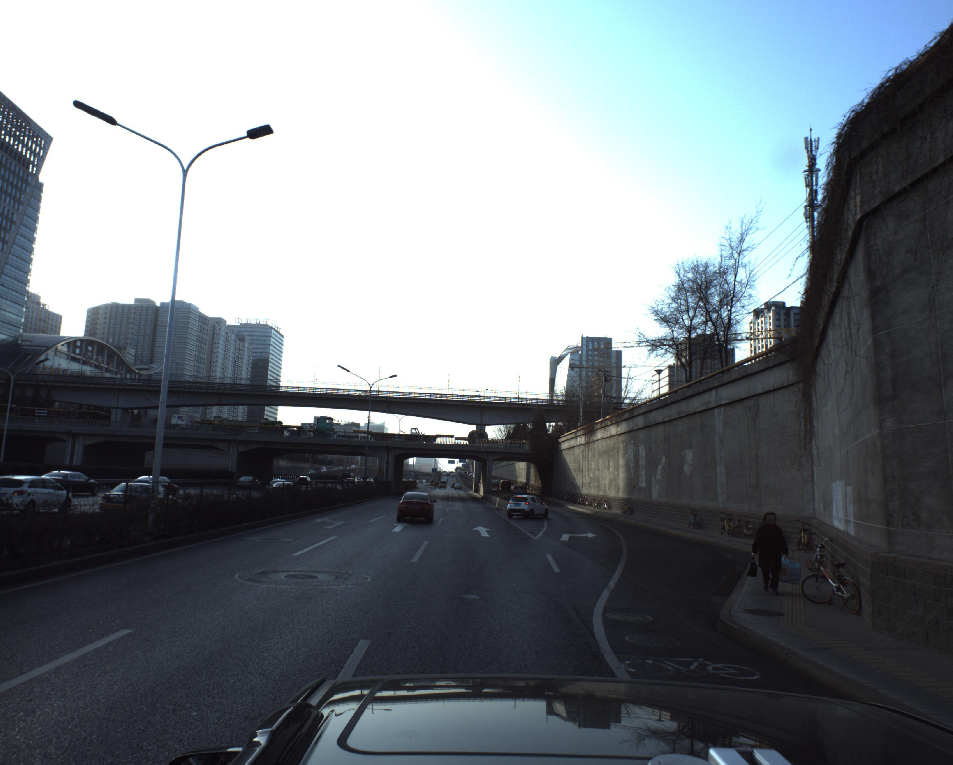
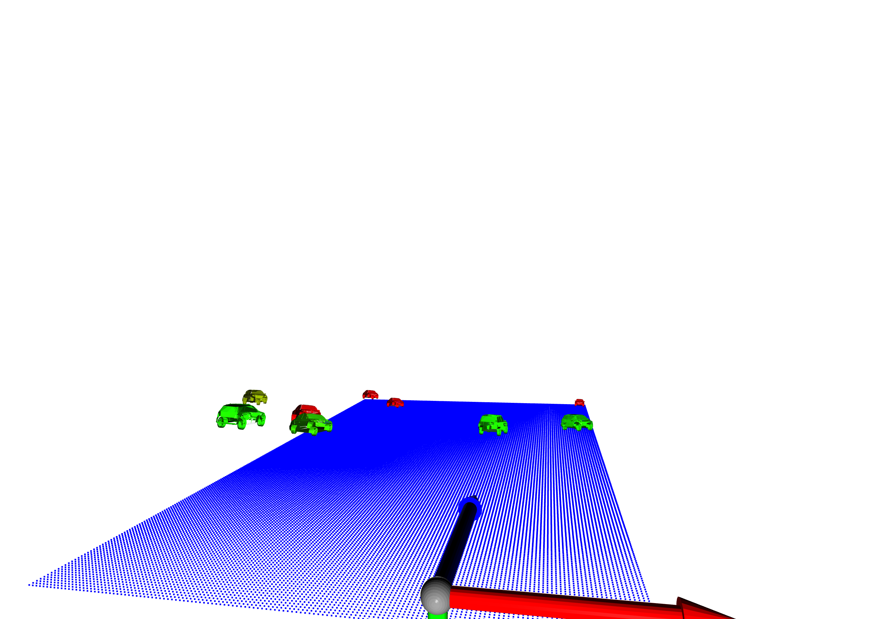

# Kaggle_PKU_Baidu

Kaggle_PKU_Baidu


##  Visualisation using Open3D

Using [Open3d](http://www.open3d.org/) to visualise the predicted 
validation images.

RGB             |  Open3d vis
:-------------------------:|:-------------------------:
  |   


### install open3d
`pip install open3d`

### Run the demo file
`python ./demo/open3d_vis_kaggle.py`

Press `q` to see next valid image.

There are some parameters need to be set, in the visualisation code, I hard coded them

```
car_model_dir =  The car models in json
valid_pred_file = Your predicted valid.pkl file
train_img_dir = Training images dir
train_df = Kaggle train.csv
```

There is also a default view point file that I have customised for us.
How to use it: open the `demo/open3d_view.json` copy it (`Ctrl+C`) and paste it on the Open3d visualisation window.

### Color denoatation

-  `A False Positive (Wrong prediction)`
-  `A True positive: if it's a bit red, then it's less accuracte because of translation mismatch`
-  `A True positive: if it's a bit blue, then it's less accuracte because of the rotation mismatach`

-  `A False Negative (Missing detection)`

### Mouse view control

    """
    http://www.open3d.org/docs/tutorial/Basic/visualization.html
    -- Mouse view control --
      Left button + drag        : Rotate.
      Ctrl + left button + drag : Translate.
      Wheel                     : Zoom in/out.
    -- Keyboard view control --
      [/]          : Increase/decrease field of view.
      R            : Reset view point.
      Ctrl/Cmd + C : Copy current view status into the clipboard. (A nice view has been saved as utilites/view.json
      Ctrl/Cmd + V : Paste view status from clipboard.
    -- General control --
      Q, Esc       : Exit window.
      H            : Print help message.
      P, PrtScn    : Take a screen capture.
      D            : Take a depth capture.
      O            : Take a capture of current rendering settings.
    """

##  Neural Mesh Renderer

The read me file can be accessed at: [NMR](README_Neural_Mesh_Renderer.md)