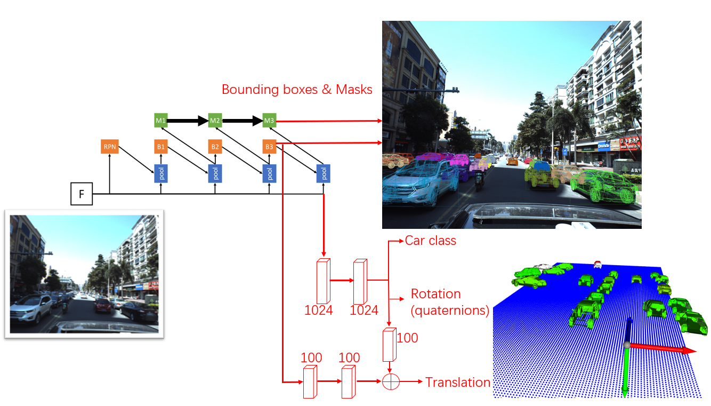

# 2nd Place for Kaggle_PKU_Baidu

Firstly congratulations to all top teams.

Secondly I would like to congratulate to all my teammates 
for this collaborative team work, every member of the team 
is indispensable in this competition.


## Approach 

The overall pipeline is largely improved on previous method 6D-VNet[[1]](#references).
We reckon we are the very few teams that didn't use CenterNet as the main network).
The system pipeline is as follows (the red color denotes the modules we added for this task):



The three major improvement consists of
(1) better detector and conv backbone structure,
(2) post-processing with both mask and mesh information both geometrically and  via a Neural Mesh Renderer (NMR)[[4]](#references) method.
(3) novel way of ensembling of multiple models and
weighted average of multiple predictions. We specify the implementation details as follows:


### Implementation details
We build our framework based upon the open source project 
[MMDetection](https://github.com/open-mmlab/mmdetection]). This is an excellent framework that can help us to modulised the code.
Pixel-level transform for image augmentation is called from the [Albumentations](https://github.com/albumentations-team/albumentations) library.

The detector is a 3-stage Hybrid Task Cascade (HTC) [[2]](#references) and the backbone is ImageNet pretrained 
High-resolution networks (HRNets) [[3]](#references). 
We design two specific task heads for this challenge: one head taking ROIAligh feature
for car class classification + quaternion regression and one head taking bounding box information (centre location, height and width)
for translation regression.
With this building block, we achieved private/public LB: 0.094/0.102.

We then incorporated the training images from ApolloScape dataset and
after cleaning the obviously wrong annotations, this leaves us with 6691 images and ~79,000 cars for training,
The kaggle dataset has around 4000 images for training,
we leave out 400 images randomly as validation. With tito(@its7171) code for evaluation, we obtained 
~0.4 mAP. On public LB, we have only 0.110.
Such discrepancy between local validation and test mAP is a conumdrum that perplexes us until today!

### Postprocessing
After visual examination, we find out the detector is working well (really well)
for bounding box detection and mask segmentation (well, there are 100+ top conference paper doing the 
research in instance segmentation anyway). But the generated mesh from rotation and
translation does not overlap quite well with the mask prediction.
Thus, we treat `z` as the oracle prediction and amend the value for `x` and `y` prediction.
This gives us a generous boost to 0.122/0.128 (from 0.105/0.110). 


### Model ensembles
Model ensemble is a necessity for kaggle top solutions: we train 
one model that directly regresses translation and 
one model regresses the `sigmoid` transformed translation.
The third model is trained with 0.5 flip of the image.

Because of the speciality of the task: the network can output mask and mesh 
simultaneously, we merge the model by non-maximum suppression using the IoU 
between the predicted mesh and mask as the confident score.
The `max` strategy gives 3 model ensemble to 0.133/0.142.
The `average weighting` strategy generates even better result and 
is the final strategy we adopted.

The organisors also provide the maskes that will be ignored during test evaluation.
We filtered out the ignore mask if predicted mesh has more than 20% overlap,
this will have around 0.002 mAP improvement.

Below is the aforementioned progress we have achieved in a tabular form:


|Method              | private LB             |  public LB|
|:------------------: | :-------:|:-------------------------:|
|HTC + HRNet + quaternion + translation | 0.094  | 0.102|
|+ ApolloScape dataset      | 0.105          | 0.110|
|+ z-> x,y (postprocessing) | 0.122          | 0.128|
|+ NMR                      | 0.127          | 0.132|
|conf (0.1 -> 0.8)          | 0.130          | 0.136|
|+ 3 models ensemble (max)  | 0.133          | 0.142|
|+ filter test ignore mask  | 0.136          | 0.145|
|+ 6 models ensemble(weighted average)| 0.140 | 0.151|
  
  
## Other bolts and nuts
 
###  Visualisation using Open3D

We also use [Open3d](http://www.open3d.org/) to visualise the predicted 
validation images. The interactive 3d rendering technique allows us to examine
the correctly predicted cars in the valid set. 

### Neural Mesh Renderer (NMR)
Neural 3D Mesh Renderer [[4]](#references) is a very cool research which generates an approximate gradient
for rasterization that enables the integration of rendering into neural networks.
After releasing of the final private LB, we found out  using NMR actually gives
a small improvement of the overall mAP. 


### What we haven't tried but think it has decent potential

- Almost all the top winning solution adopted the CenterNet [[5]](#references), it's very likely that the model ensemble with
CentreNet will further boost the overall performance. We realise the universal
adoptation of CenterNet in this challenge. We might be too comfortable sitting
in our existing framework and the migration to fine-tune CenterNet seems a bit hassle
which in return might ultimately causes us the top prize. 

- Allocentric vs. Egocentric [[6]](#references). 
Allocentric representation is equivariant w.r.t. to RoI Image appearance, and is
better-suited for learning. As also discussed [here](https://www.kaggle.com/c/pku-autonomous-driving/discussion/127052),
the modification of orientation id done by rotation matrix that moves camera
center to target car center. But we are aware from the beginning that prediction of 
translation is far more difficult that rotation prediction, we didn't spend much effort in
perfecting rotation regression.
```python
yaw = 0
pitch = -np.arctan(x / z)
roll = np.arctan(y / z)
r = Rotation.from_euler("xyz", (roll, pitch, yaw))
```


### References

- [1] 6D-VNet: End-To-End 6-DoF Vehicle Pose Estimation From Monocular RGB Images, Di WU et et., CVPRW2019 
- [2] Hybrid task cascade for instance segmentation, Chen et al., CVPR2019
- [3] Deep High-Resolution Representation Learning for Human Pose Estimation, Sun et al., CVPR2019
- [4] Neural 3D Mesh Renderer, Hiroharu Kato et al., CVPR2018
- [5] Objects as Points, Xingyi Zhou et al. CVPR2019
- [6] 3D-RCNN: Instance-level 3D Object Reconstruction via Render-and-Compare, Abhijit Kundu et al., CVPR 2018

